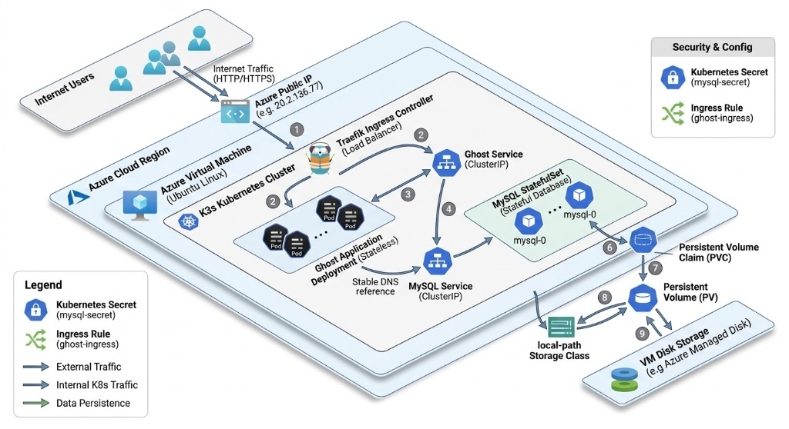
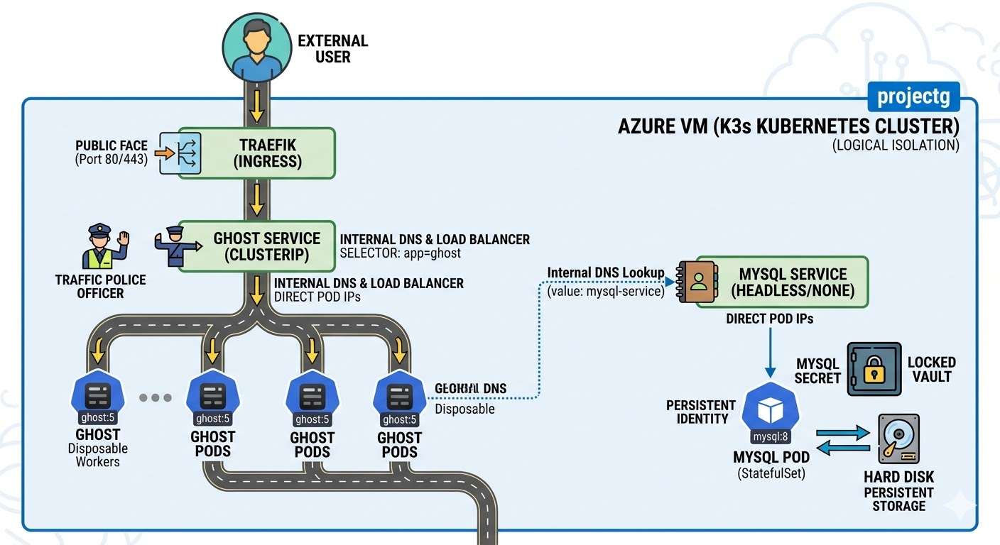
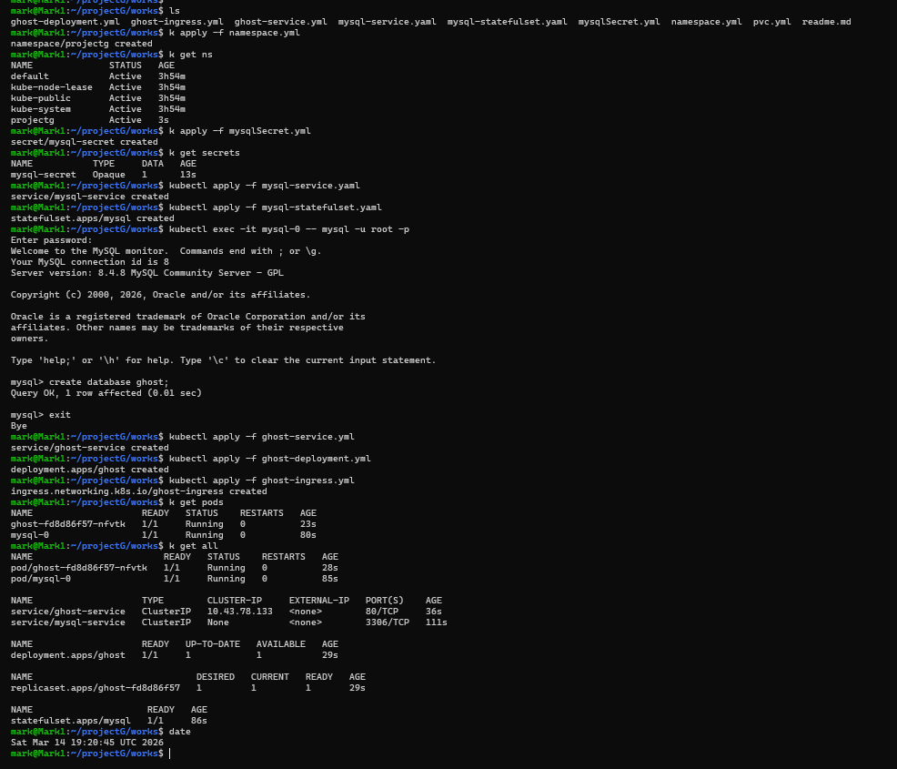

# Ghost on Kubernetes (K3s)

Production-Ready **Ghost**,  **blogging platform** running on a **K3s cluster**, using **Traefik Ingress, MySQL StatefulSet, Kubernetes Secrets, and Persistent Storage**.

This project demonstrates how to deploy a **stateful multi-tier application on Kubernetes** with proper networking, storage, and security practices.

---

# 📌 Project Overview

This project deploys a **fully functional blogging platform (Ghost)** on Kubernetes.

# Architecture Overview

The system runs on a **single-node K3s cluster** inside an Azure Ubuntu VM and includes:

* **Ghost Deployment** – stateless application pods  
* **MySQL StatefulSet** – stable network identity with persistent storage via **PVC**  
* **ClusterIP Services** – internal DNS-based communication  
* **Traefik Ingress** – handles external HTTP traffic through the Azure public IP  
* **Secrets** – secure storage for database credentials  

External traffic flows from the **Internet → Azure Public IP → Traefik Ingress → Ghost Service → Ghost Pods → MySQL** with data persisted on the **Azure VM disk** via PVC.

---

# Tech Stack

| Component          | Technology            |
| ------------------ | --------------------- |
| Kubernetes         | K3s                   |
| Ingress Controller | Traefik               |
| Application        | Ghost (Docker image)  |
| Database           | MySQL                 |
| Storage            | PersistentVolumeClaim |
| Secrets            | Kubernetes Secrets    |
| Networking         | Kubernetes Services   |

# Kubernetes Components Used

The project uses a **Namespace** for isolation, a **Secret** for MySQL root password, and a **StatefulSet** with **PersistentVolumeClaim** for MySQL to ensure stable networking and persistent storage. Ghost runs as a **Deployment** for stateless pods. **Services** provide DNS-based communication, and **Traefik Ingress** routes external HTTP traffic to Ghost via the Azure VM public IP.

# Deployment Steps

### 1️⃣ Clone the repo and run the belwo commands

```
kubectl apply -f namespace.yml
```

---

### 2️⃣ Create Secret

```
kubectl apply -f mysql-secret.yaml
```

---

### 3️⃣ Deploy MySQL Database

```
kubectl apply -f mysql-service.yaml
kubectl apply -f mysql-statefulset.yaml
```
---

### 4️⃣ Deploy Ghost Application

```
kubectl apply -f ghost-deployment.yaml
kubectl apply -f ghost-service.yaml
```
---

### 5️⃣ Create Ingress

```
kubectl apply -f ghost-ingress.yaml
```

---

### 6️⃣ Access the Blog

Open in browser:

```
http://<AZURE_VM_PUBLIC_IP>
```

---


# Possible enhancements for production-grade systems:
* Horizontal Pod Autoscaling (HPA)
* GitOps deployment using **ArgoCD**
* Monitoring with **Prometheus + Grafana**
---

